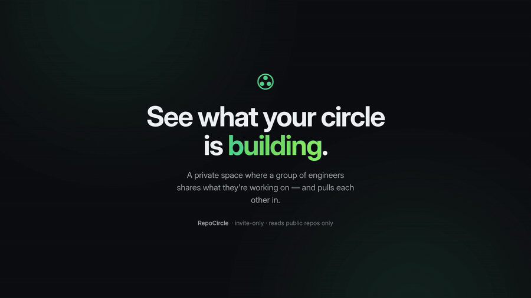
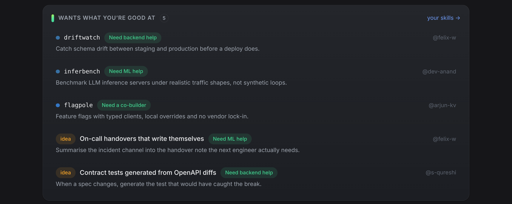
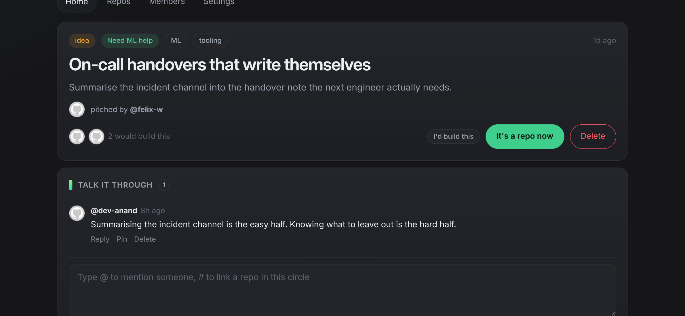
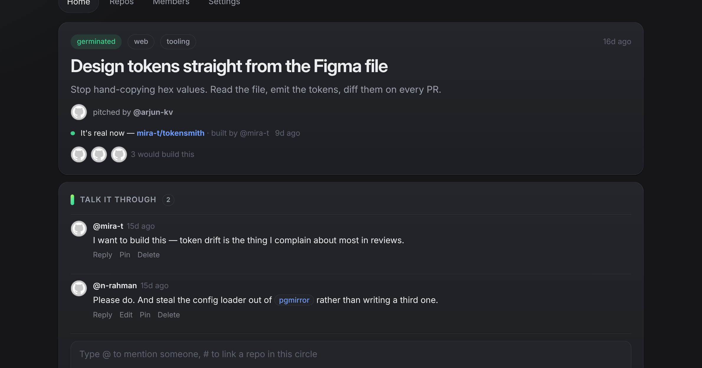
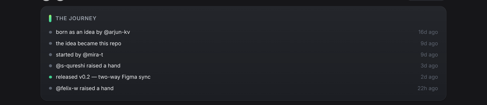
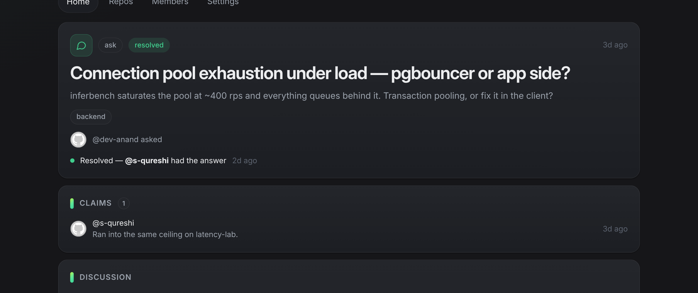

<div align="center">


# RepoCircle

**See what your circle is building. Ask to join in.**

An invite-only space where a group of engineers can see each other's work in progress — and join in on it.

[Live app](https://calmcodelabs.github.io/repocircle/) · [How it works](#how-it-works) · [Documentation](#documentation) · [Run it yourself](#run-your-own)

[](https://github.com/calmcodelabs/repocircle/actions/workflows/deploy.yml)


</div>

<br>



<br>

## The problem

Someone in your circle is building the thing you need. You'll find out in six months, by accident.

Work stays invisible until it happens to come up in conversation. Ideas stay in one head because pitching them feels like an interruption. And a request for help, posted to a busy channel, is gone within the hour.

RepoCircle is the shared window: your circle's repositories, the ideas that aren't repositories yet, and a short path from *"that looks interesting"* to *"I'm building it with you."*

**No leaderboards, no streaks, no contribution counts.** That's a rule, not an omission — nothing here ranks one member against another.

## What it does

### Work finds the person who can help

State once what you can help with — frontend, backend, ML, design, or review. Anything that asked for exactly that surfaces on your home page. Nobody has to broadcast a request, and nobody volunteers blind.



### Ideas count, before there is any code

An idea needs no repository to exist here. Give it a sentence and the kind of help it wants; the circle can argue with it, sharpen it, and raise a hand to build it.



When it becomes real, the idea links to the repository it turned into, and that repository credits whoever thought of it. **The person who builds something needn't be the person who imagined it** — that exchange is the point of the whole app.



### Every project remembers how it started

Born as an idea, picked up, joined, released. Assembled from facts the app already holds — never scored, never totalled into a ranking.



### Ask for help, and credit the answer

Post what you're stuck on; someone claims it. On resolution the ask names who had the answer — a single fact on a single page, never a tally.



### And the rest

| | |
|---|---|
| **Live activity** | Commits, pull requests and releases arrive as sparklines, polled in the browser — no webhooks to configure |
| **People, not usernames** | What each member offers, what they're learning, and the languages they actually write — read from their repositories, not self-reported |
| **While you were away** | Replies, mentions and raised hands, collected for your next visit rather than pushed at you all day |
| **Collaborator requests** | One tap opens a real GitHub issue; accepting it sends a real collaborator invitation |
| **Discord** | An optional webhook, so the conversation stays where your circle already talks |
| **Installable** | A progressive web app on phone and laptop, with an offline shell |

## How it works

RepoCircle is a static single-page app. There is nothing to deploy but the files themselves.

```
Browser (Preact + TypeScript)
   ├── Firebase Auth ......... GitHub sign-in
   ├── Cloud Firestore ....... all data, behind per-circle security rules
   └── GitHub REST API ....... polled client-side with the signed-in user's token
```

**Only public repositories are ever read.** The app requests no private-repository scope, and the GitHub token is held in memory and `sessionStorage` — never written to the database.

Circles are private, and membership gates every read and write — enforced in [`firestore.rules`](firestore.rules) and held there by an emulator test suite in CI.

Each significant decision, and what it cost, is recorded as an ADR in [docs/DECISIONS.md](docs/DECISIONS.md).

## Run your own

```bash
git clone https://github.com/calmcodelabs/repocircle
cd repocircle
npm install
npm run dev          # Vite dev server
```

To point it at your own Firebase project, follow [docs/SETUP.md](docs/SETUP.md): a GitHub OAuth app, a Firebase project, one config file. Then:

```bash
npm run test         # unit tests
npm run test:rules   # security rules against the Firestore emulator (needs Java)
npm run deploy:rules # publish rules + indexes
npm run build        # static build → dist/
```

Every push to `main` builds and deploys to GitHub Pages.

## Documentation

| Document | What's in it |
|---|---|
| [POSITIONING.md](docs/POSITIONING.md) | Who this is for, who it isn't, and the reasoning |
| [ARCHITECTURE.md](docs/ARCHITECTURE.md) | System design, data flow, the polling engine, PWA strategy |
| [SECURITY.md](docs/SECURITY.md) | Threat model, token policy, CSP and XSS stance |
| [DATA-MODEL.md](docs/DATA-MODEL.md) | Every collection, field and index |
| [DECISIONS.md](docs/DECISIONS.md) | ADRs — why each decision was taken, and what it cost |
| [REVIEW.md](docs/REVIEW.md) | The failure classes this codebase has hit, and the sweep run against every change |
| [PLAN.md](docs/PLAN.md) | Milestones, acceptance criteria, risk register |
| [UI.md](docs/UI.md) | The design system |
| [SETUP.md](docs/SETUP.md) | First-time Firebase and GitHub setup |

## License

[MIT](LICENSE). Fork it, change it, run a circle of your own.

## Status

Deployed and under active development. The core is complete: circles and invites, the repository registry, activity, asks, collaborator requests, profiles and skill matching, discussion, and the full idea lifecycle. Every change is swept against the failure classes in [REVIEW.md](docs/REVIEW.md).

The screenshots and demo video show a fabricated community — no real account, project or conversation appears in them. Details in [docs/screenshots/README.md](docs/screenshots/README.md).
