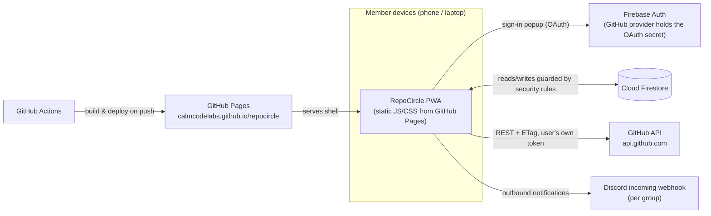

# RepoCircle — Architecture

This document describes the system design for RepoCircle Phase 1 and the reasoning
behind it. It adapts the PRD's suggested stack (§12) to a hard constraint set by the
project owner: **host it exactly like Score Keeper** — a static PWA on GitHub Pages
with Firebase as the only backend, on the free Spark plan, with no card and no server.

Related: [DATA-MODEL.md](DATA-MODEL.md) · [SECURITY.md](SECURITY.md) ·
[DECISIONS.md](DECISIONS.md) · [PLAN.md](PLAN.md)

## 1. Constraints and what they rule out

| Constraint | Consequence |
|---|---|
| Static hosting only (GitHub Pages) | No server-rendered pages, no API routes, no webhook receiver endpoint |
| Firebase Spark (free, no card) | Auth + Firestore + Hosting-adjacent services only. **No Cloud Functions** (Blaze-only), no FCM *sending*, no scheduled jobs |
| Public repo (Pages free tier requires it) | Zero secrets in the codebase, ever. Firebase web config is public-by-design (like Score Keeper) |
| Phone + laptop as a webapp | Responsive PWA, installable, offline-tolerant shell |
| "Secure in every way" | Firestore security rules are the *entire* server-side authorization layer — they get their own document, test suite, and release gate |

### PRD stack vs. chosen stack

| PRD §12 suggestion | Chosen | Why |
|---|---|---|
| Next.js/SvelteKit, server-rendered Home | Vite + Preact + TypeScript SPA, hash routing | No server. Preact keeps the bundle small; hash routing avoids Pages' lack of SPA rewrites under a subpath |
| PostgreSQL + row-level tenancy | Firestore + security-rules tenancy | Only free serverless DB that enforces per-user authorization *without our own backend* |
| Worker process + BullMQ/Redis for webhooks & jobs | Client-side polling engine with ETag caching + idempotent writes | PRD §7.4 itself defines polling as the fallback; see §5 below |
| NextAuth + hand-rolled OAuth | Firebase Auth GitHub provider | OAuth handshake (incl. client secret) runs on Firebase's servers, not ours |
| Railway/Fly/Render hosting | GitHub Pages + GitHub Actions build | $0, proven by Score Keeper |
| discord.js bot (P0) | Discord *incoming webhook* per group for outbound posts; slash commands deferred | A bot process cannot exist without a server. Outbound webhook covers the P0 notification loop; see ADR-007 |

## 2. System overview



Key property: **every network call is made by a signed-in member's browser using that
member's own credentials** (Firebase ID token for Firestore, GitHub OAuth token for
GitHub). There is no shared service credential anywhere in the system.

## 3. Client application structure

```
src/
  main.tsx              # boot: auth listener, router, global stores
  router.ts             # hash router  #/g/:groupId/(home|repos|members|settings)...
  firebase.ts           # app init, firestore handles, offline persistence
  auth/                 # sign-in, scope escalation, token vault (see SECURITY §5)
  github/               # typed REST client, ETag cache, rate-limit guard, normalizers
  poll/                 # polling engine: staleness claims, event ingestion, rollups
  data/                 # Firestore repositories: groups, members, repos, asks, ...
  ui/                   # design system primitives (Card, Pill, Spark, Sheet, ...)
  views/                # screens: FirstRun, Home, RepoDetail, Members, Settings...
  notify/               # in-app notification badge + Discord webhook posting
  pwa/                  # manifest, service worker registration, install prompt
  util/                 # ids, time, validation shared with rules tests
```

- **State**: Preact signals. One store per domain (`session`, `activeGroup`,
  `asks`, `repos`…), each backed by `onSnapshot` listeners that attach when a view
  needs them and detach on navigation (quota discipline, see DATA-MODEL §7).
- **Rendering discipline**: no `dangerouslySetInnerHTML`, no `innerHTML`. All user
  content renders through text nodes (SECURITY §6).
- **Routing**: two disclosure layers max (PRD §5): Home is `#/g/:id`, modules are one
  segment deeper, settings is `#/g/:id/settings`.

## 4. Identity, auth and GitHub tokens

1. `signInWithPopup(GithubAuthProvider)` with minimal scopes `read:user user:email`.
2. Firebase handles the OAuth code exchange server-side; we receive the Firebase user
   plus a **GitHub access token** in the popup result.
3. The GitHub token is kept in a **token vault**: in-memory first, mirrored to
   `sessionStorage` (per-tab, survives reloads, dies with the tab). It is **never**
   written to Firestore or localStorage. Rationale + threat model: SECURITY §5.
4. When a feature needs `public_repo` (registering repos is read-only and does *not*;
   creating the collab-request issue and accepting invites *do*), we run
   `reauthenticateWithPopup` with the escalated scope — matching PRD F-01's
   "contextual escalation".
5. If the vault is empty (new tab, token expired/revoked), any GitHub-touching action
   transparently triggers a re-auth popup; Firestore-only browsing needs no GitHub token.

GitHub OAuth App tokens don't expire unless revoked, but we treat them as ephemeral
per-tab material anyway — the cost is one popup per new session that touches GitHub.

## 5. Activity ingestion without webhooks

PRD I-01 assumes a webhook receiver; we cannot host one. PRD §7.4 already specifies
the fallback we promote to the primary mechanism: **polling the Events API** — and
§9.2 confirms it's sufficient for a 7-day activity window.

### The polling engine (runs in every open client)

1. On app open, and every 15 minutes while the tab is visible (`visibilitychange`-aware),
   the engine lists the active group's repos where `poll.lastPolledAt < now − 15 min`.
2. For each stale repo it attempts a **claim**: a Firestore transaction that re-checks
   staleness and writes `poll.lastPolledAt = now`. Losing the transaction means another
   member's client is already on it — skip. This prevents the thundering herd.
3. The claimant calls `GET /repos/{full_name}/events` with `If-None-Match: <etag>`
   (etag persisted on the repo doc). `304 Not Modified` costs **zero** rate limit and
   ends the cycle for that repo.
4. New events are normalized (`PushEvent`, `PullRequestEvent`, `IssuesEvent`,
   `ReleaseEvent`, `CreateEvent`, `ForkEvent`) into compact `ActivityEvent` docs,
   written with **doc ID = GitHub event ID** — writes are idempotent, duplicates are
   structurally impossible.
5. The same batch updates `activityDaily/{YYYY-MM-DD}` counters (commits, PRs opened/
   merged, issues, releases) and `repo.lastEventAt`. Sparklines and "Active this week"
   are pure queries over these (no further computation).

### Rate-limit budget (PRD §9.3)

| Quantity | Value |
|---|---|
| Authenticated REST limit | 5,000 req/hr *per member token* |
| Poll cost per repo per cycle | 1 request (0 against limit when 304) |
| Worst case: 100-repo group, one client polling alone | 400 req/hr — 8% of one user's limit |
| Sync jobs (profile, repo list, contributors) | ≤ 30 req/day/user, ETag-cached |

The budget spreads naturally: whichever members have the app open share the polling
work via claims. A `X-RateLimit-Remaining < 500` guard pauses non-essential calls.

### Honest trade-offs

- Freshness is "seconds while someone has the app open; stale otherwise". For a
  5–50-person group this matches actual usage (you open the app, it's current).
- The Events API omits some event types and history beyond 90 days/300 events — fine
  for a 7-day window (PRD §9.2 says exactly this).
- A malicious member could write fabricated events (rules validate shape, not truth
  against GitHub). Accepted for Phase 1's trust model; SECURITY §4 covers it; the
  Phase-3 Worker upgrade (§9) eliminates it.

## 6. Core flows

### Ask / stuck-flag loop (PRD §7.2)
Composer → `asks/{id}` create (rules-validated) → Home listeners update instantly →
fire-and-forget POST to the group's Discord webhook with a backlink →
claim writes `claims/{uid}` + updates state → resolve by author/admin → Unblocked
counter is a `count()` aggregation query, never a stored total.

### Collaborator request (PRD §7.3)
Requester (needs `public_repo`): create GitHub issue "Collaboration request from @login"
(label `collab-request`, created if missing) → `collabRequests/{id}` doc (pending) →
Discord post + in-app badge for the owner. Owner accepts *in their own client with
their own token*: `PUT /repos/{owner}/{repo}/collaborators/{username}` → close issue
with templated comment → doc state `accepted`. Decline: close issue politely, state
`declined`. The app never holds a token able to act as anyone but the current user.

### First run (PRD §7.1)
Sign in → upsert `users/{uid}` → invite token in URL? validate & join : create-group
screen → repo import picker (owner's public repos preselected, opt-out per PRD F-04)
→ Home renders from cache-first Firestore + kicks the polling engine so "Active this
week" fills within seconds.

## 7. PWA, offline and performance

- **Installable**: manifest (standalone, theme `#0E0F12`), maskable icons, iOS meta tags.
- **Service worker**: precache the built shell (hashed assets); network-first for
  `index.html`; cache-first for avatars. Firestore data is *not* SW-cached — the SDK's
  IndexedDB persistence (`persistentLocalCache`) already gives offline reads and queued
  writes.
- **Performance budget** (PRD §11 wants Home < 1.5 s on mid-range Android/4G):
  JS ≤ 220 KB gzipped total (Preact ~4, Firebase auth+firestore ~110, app ≤ 80,
  fonts 2 × ~45 KB woff2 self-hosted, swap). Warm loads render Home from IndexedDB
  before the network answers — effectively instant; cold first visit ~2 s on 4G is
  accepted and documented as the trade for having no SSR. Skeleton rows, never spinners.
- **Code-split** Layer-2 modules (Members/Repos detail/Settings) behind dynamic import.

## 8. Observability (PRD §11, serverless edition)

- Structured `console` logging behind a `?debug=1` flag.
- A hidden diagnostics view (`#/diag`): auth state, token scopes (never the token),
  Firestore latency, last poll cycle per repo, GitHub rate-limit headroom.
- Firestore usage watched in the Firebase console; a `meta/health` doc tracks last
  successful poll per group so staleness is visible in-app ("last refreshed 2 h ago").
- Client errors: rendered to the user honestly + kept in a ring buffer on `#/diag`.
  No third-party telemetry — nothing to configure, nothing leaking user data.

## 9. Phase-3 upgrade path (optional, still $0): one Cloudflare Worker

When (if) the trust model or feature set outgrows client-side-only:
real GitHub **webhooks** (HMAC-verified, the PRD's original I-01), Discord **slash
commands** (`/active`, `/asks`, `/whois` need an interactions endpoint), **web push**
sending, **iCal feed** URLs, and **digest email** all become possible with a single
free-tier Cloudflare Worker holding a Firebase service account. It's deliberately
*not* in Phase 1: it adds a second platform, a real secret to manage, and an always-on
attack surface. The data model already anticipates it (`ActivityEvent.source` field).

## 10. What Phase 1 explicitly does not do (and where it's honestly handled)

| PRD item | Status | Where covered |
|---|---|---|
| I-01 webhooks | Replaced by polling engine | §5, ADR-004 |
| I-02 slash commands | Outbound-only Discord in P1; commands → Worker (Phase 3) | ADR-007 |
| G-10 weekly digest email | In-app + Discord digest post in Phase 2; email → Phase 3 | PLAN §6 |
| N-03 web push | Needs a sender → Phase 3 Worker | PLAN §7 |
| I-06 iCal subscription feeds | Downloadable .ics in Phase 2; live feed URL → Phase 3 | PLAN §6 |
